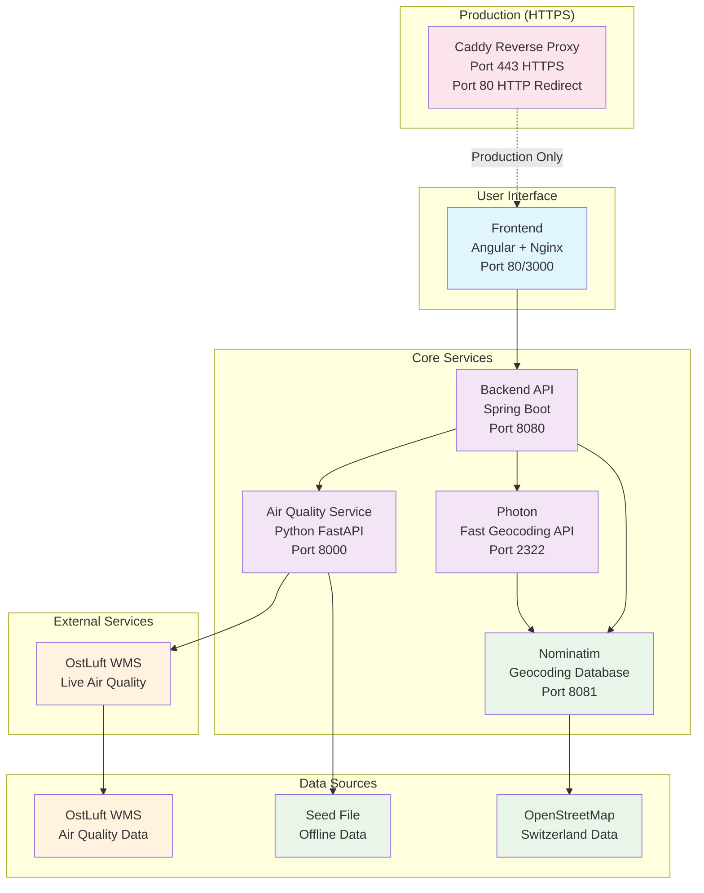

# Routify


[](https://ethz.ch)
[](https://opensource.org/licenses/MIT)
[](https://docker.com)

**Routify** is an intelligent routing system that provides personalized route recommendations based on environmental factors such as air quality, noise levels, green spaces, and altitude. Built for the Zurich area, it helps users find the healthiest and most pleasant paths for walking, cycling, and driving.

> 🌱 **Research Project**: This is an academic research project developed at ETH Zurich, focusing on sustainable urban mobility and environmental-aware navigation systems.

## What is Routify?

Routify is a research project that goes beyond traditional navigation by considering environmental factors in route planning. Instead of just finding the shortest or fastest route, Routify helps users discover paths that are:

- **Healthier** - Routes with better air quality (PM10 levels)
- **Quieter** - Paths with lower noise pollution
- **Greener** - Routes through parks and green spaces
- **More pleasant** - Considering altitude and scenic factors

The system uses environmental data and advanced routing algorithms to provide personalized recommendations based on user preferences and current conditions.

## Key Features

- 🚶 **Multi-Modal Routing**: Support for walking, cycling, and driving
- 🌿 **Environmental Factors**: Air quality (PM10), noise levels, green spaces, altitude
- 🎯 **Personalized Preferences**: Adjustable weights for different environmental factors
- 🗺️ **Interactive Map**: Real-time route visualization with environmental overlays
- 📊 **Route Analytics**: Detailed analysis of environmental conditions along routes
- 🏙️ **Zurich Focus**: Optimized for the Zurich metropolitan area
- 🐳 **Docker Ready**: Easy deployment with Docker Compose

## System Architecture



## Technology Stack

### Frontend
- **Angular 17** - Modern web framework
- **Leaflet** - Interactive maps
- **Material Design** - UI components
- **TypeScript** - Type-safe development

### Backend
- **Spring Boot** - Java framework
- **JGraphT** - Graph algorithms
- **Maven** - Dependency management

### Data & Services
- **Nominatim** - OpenStreetMap geocoding
- **Photon** - Fast geocoding API
- **PostgreSQL** - Geospatial database
- **Python FastAPI** - Air quality service
- **Docker** - Containerization

### External Data Sources
- **OpenStreetMap** - Road network data
- **OstLuft** - Air quality data
- **Geofabrik** - Switzerland OSM extracts

## People & Research

This project is developed as part of research at **ETH Zurich** and is associated with the **Professorship  of Computational Social Science (COSS)**.

### Research Paper
- **Title**: "Democratizing Urban Mobility Through an Open-Source, Multi-Criteria Route Recommendation System"
- **Authors**: Alexander Eggerth, Javier Argota Sánchez-Vaquerizo, Dirk Helbing and Sachit Mahajan
- **Institution**: ETH Zurich, COSS
- **Publication**: [ACM Digital Library](https://dl.acm.org/doi/10.1145/3640457.3691702)

### Key Contributors
- **Sachit Mahajan** (sachit.mahajan@gess.ethz.ch) - Research Supervisor
- **Alexander Eggerth** (aeggerth@ethz.ch) - Lead Developer
- **Javier Argota Sánchez-Vaquerizo** (javier.argota@gess.ethz.ch) - Research Collaborator
- **Christoph Schweighofer** (christoph.schweighofer@inf.ethz.ch) - Developer
- **Dirk Helbing** (dhelbing@ethz.ch) - CoCi PI, Mentor
- **COSS Team** - Research Support and Guidance

### Research Context
This project contributes to the field of **sustainable urban mobility** by developing intelligent routing systems that consider environmental factors. The research explores how technology can help citizens make more informed decisions about their daily commutes, potentially reducing exposure to pollution and improving overall urban living quality.

### Research Impact
- **Academic Contribution**: Novel approach to multi-criteria routing with environmental factors
- **Practical Application**: Real-world implementation for Zurich metropolitan area
- **Open Science**: Open-source implementation for reproducibility and further research
- **Community Benefit**: Free tool for citizens to make healthier transportation choices

## Quick Start

This repository contains the Routify frontend (Angular) and backend (Spring Boot). The recommended way to run both is via Docker Compose.

### Prerequisites
- Docker and Docker Compose installed

### Start the application
```bash
docker-compose up -d --build
```

This builds and starts:
- **backend** on port 8080 (Spring Boot API)
- **frontend** on port 3000 (Angular web app; see HTTPS proxy section below)
- **nominatim** on port 8081 (Geocoding database with Switzerland data)
- **photon** on port 2322 (Fast geocoding search API)
- **airqualityservice** on port 8000 (Air quality data service)
- **docs** on port 8085 (Generated Doxygen docs with Mermaid diagrams for frontend & backend)

Initial startup times (depending on downlink speed):
- **Nominatim**: ~20 minutes (1200s start_period) for first-time data import
- **Photon**: ~2 minutes (120s start_period) after Nominatim is ready
- **Air Quality Service**: ~1 minute (120s start_period)
- **Backend**: ~4 minutes (240s start_period)
- **Frontend**: ~2 minutes (120s start_period) 

After the stack is up, wait until `docker ps` shows each service with `STATUS` ending in `healthy`—services still reporting `(health: starting)` are not ready for use yet.

### Access URLs (Local Development)
- **Frontend**: http://localhost:3000
- **Backend API**: http://localhost:8080/
- **Backend Health**: http://localhost:8080/health
- **Nominatim API**: http://localhost:8081/search?q=zurich&format=json
- **Photon API**: http://localhost:2322/api?q=zurich
- **Air Quality Service**: http://localhost:8000/status
- **Documentation Portal**: http://localhost:8085/

### Access URLs (Production with Caddy)
When running with `--profile prod`, Caddy provides HTTPS access:
- **Frontend**: https://demo.routify.ch (or https://routify.ch)
- **Backend API**: https://demo.routify.ch/api/*, /route/*, /status/*, /query/*
- **Photon API**: https://demo.routify.ch/photon/*
- **Documentation**: https://demo.routify.ch/docs/
- **Backend Health**: https://demo.routify.ch/health

Example health checks:
```bash
# Backend health
curl -s http://localhost:8080/health
# Expect: {"status":"UP"}

# Test geocoding services
curl "http://localhost:8081/search?q=zurich&format=json&limit=3"  # Nominatim
curl "http://localhost:2322/api?q=zurich"  # Photon

# Test air quality service
curl "http://localhost:8000/status"  # Air Quality Service status

# Regenerate documentation (includes Mermaid/Graphviz rendering)
docker-compose build docs && docker-compose up -d docs
```

### Optional: HTTPS proxy (production)

A Caddy reverse proxy is included in the compose file to terminate TLS for `demo.routify.ch` and `routify.ch`. It is disabled by default and only runs when the `prod` profile is enabled. 

**Production Setup:**
1. Point DNS records (`demo.routify.ch` and `routify.ch`) to your server.
2. Start Caddy alongside the core services:
   ```bash
   docker-compose --profile prod up -d caddy
   docker-compose up -d
   ```
3. Certificates are requested automatically from Let's Encrypt and stored in the `caddy_data` volume.
4. All traffic is routed through Caddy:
   - Frontend: `https://demo.routify.ch`
   - Backend API: `https://demo.routify.ch/api/*`, `/route/*`, `/status/*`, `/query/*`
   - Photon: `https://demo.routify.ch/photon/*`
   - Documentation: `https://demo.routify.ch/docs/`

**Local Development:**
When running locally (without `--profile prod`), Caddy is not started. Services are accessible directly:
- Frontend: `http://localhost:3000` (direct access, no HTTPS)
- Backend: `http://localhost:8080` (direct access)
- Photon: `http://localhost:2322` (direct access)
- Documentation: `http://localhost:8085` (direct access)

The frontend automatically detects the environment and uses appropriate URLs (direct localhost URLs for local development, relative paths for production).

### Common Commands

**Start Services:**
```bash
# Start all services
docker-compose up

# Start in background
docker-compose up -d

# Rebuild and start
docker-compose up --build
```

**Stop Services:**
```bash
# Stop all services
docker-compose down

# Stop and remove volumes
docker-compose down -v

# Stop and remove images
docker-compose down --rmi all
```

**View Logs:**
```bash
# All services
docker-compose logs

# Specific service
docker-compose logs -f backend
docker-compose logs -f frontend
docker-compose logs -f nominatim
docker-compose logs -f photon
docker-compose logs -f airqualityservice
```

**Check Service Status:**
```bash
docker-compose ps
```

**Rebuild Services:**
```bash
# Rebuild and start
docker-compose up --build

# Rebuild specific service
docker-compose build backend
docker-compose build frontend
```

### Service Details

**Backend (Spring Boot)**
- Main API server for routing calculations
- Uses local resource files (no database required)
- Health endpoint: `/health`

**Frontend (Angular)**
- Web interface for route planning
- Served by Nginx on port 3000 (host) / 80 (container)
- Depends on backend service (waits for backend to be healthy)
- Connects to backend API

**Nominatim (Geocoding Database)**
- PostgreSQL database with Switzerland OSM data
- Full geocoding and reverse geocoding capabilities
- First startup: downloads and imports ~50MB of Swiss data
- Web interface available at port 8081 (mapped from internal port 8080)

**Photon (Fast Geocoding API)**
- Fast search API built on top of Nominatim
- Optimized for autocomplete and search queries
- Depends on Nominatim service (waits for Nominatim to be healthy)
- API endpoint: `/api?q=search_term`

**Air Quality Service**
- Provides PM10 air quality data for routing calculations
- Currently runs with seed file for offline/development use
- Can be switched to live mode for real-time data
- API endpoint: `/get_pm10` (POST with coordinates)
- Status endpoint: `/status`

### Air Quality Service Configuration

The air quality service is currently configured to run with a seed file for offline/development use. This provides consistent air quality data without requiring external API calls.

**Current Setup (Seed Mode):**
- Uses pre-generated seed file: `seed_1752321204.png`
- Provides static PM10 data for the Zurich area
- No external API dependencies
- Suitable for development and testing

**Switching to Live Data:**
To use real-time air quality data from OstLuft WMS service:

1. **Modify docker-compose.yml:**
   ```yaml
   airqualityservice:
     # ... other config ...
     command: ["python", "OstLuftApi.py"]  # Remove --use-seed parameter
   ```

2. **Restart the service:**
   ```bash
   docker-compose up -d --build airqualityservice
   ```

3. **Verify live mode:**
   ```bash
   curl "http://localhost:8000/status"
   # Should show "mode": "live" and "data_source": "Live WMS data"
   ```

**Generating New Seed Files:**
To create a new seed file with current data:
```bash
docker run --rm airqualityservice python OstLuftApi.py --generate-seed
# This will create a new seed_TIMESTAMP.png file
```

### Troubleshooting

**Port Conflicts:**
If ports are already in use:
```bash
# Check what's using the ports
lsof -i :80      # Caddy HTTP redirect (prod profile only)
lsof -i :443     # Caddy HTTPS (prod profile only)
lsof -i :8080    # Backend
lsof -i :3000    # Frontend (local development)
lsof -i :8081    # Nominatim
lsof -i :2322    # Photon
lsof -i :8000    # Air Quality Service
lsof -i :8085    # Documentation portal
```

**Memory Issues:**
For large datasets, increase memory allocation by modifying the backend service in docker-compose.yml:
```yaml
environment:
  - JAVA_OPTS=-Xmx4g -Xms2g
```

**Frontend Build Issues:**
If Angular build fails:
```bash
# Clear npm cache
docker-compose exec frontend npm cache clean --force

# Reinstall dependencies
docker-compose exec frontend npm install
```

**Backend Startup Issues:**
Check Java version compatibility:
```bash
# Check Java version in container
docker-compose exec backend java -version
```

**Service Health Checks:**
```bash
# Check if services are running
docker-compose ps

# Check service logs
docker-compose logs -f [service-name]

# Restart specific service
docker-compose restart [service-name]
```

### Development Workflow

1. **Start services:**
   ```bash
   docker-compose up
   ```

2. **Make code changes** in your IDE

3. **Rebuild services** after changes:
   ```bash
   docker-compose up --build
   ```

4. **View logs** for debugging:
   ```bash
   docker-compose logs -f backend
   ```

### Notes
- Nominatim first-time import takes ~10 minutes (1200s start_period)
- Data is persisted in Docker volumes between restarts
- All services are connected via Docker network
- Backend uses local resource files (no external database)
- Air quality service uses seed file by default for offline operation
- Services have health checks with appropriate start periods

## Contributing

This is a research project, but contributions are welcome! Please:

1. **Fork the repository**
2. **Create a feature branch** (`git checkout -b feature/amazing-feature`)
3. **Commit your changes** (`git commit -m 'Add amazing feature'`)
4. **Push to the branch** (`git push origin feature/amazing-feature`)
5. **Open a Pull Request**

### Development Guidelines
- Follow the existing code style
- Add tests for new features
- Update documentation as needed
- Ensure Docker builds work correctly

## License

This project is licensed under the MIT License - see the [LICENSE](LICENSE) file for details.

### Citation

If you use this code in your research, please cite our work:

```bibtex
@inproceedings{Eggerth2024,
   address = {New York, NY, USA},
   author = {Eggerth, Alexander and {Argota S{\'{a}}nchez-Vaquerizo}, Javier and Helbing, Dirk and Mahajan, Sachit},
   booktitle = {18th ACM Conference on Recommender Systems},
   doi = {10.1145/3640457.3691702},
   isbn = {9798400705052},
   month = {oct},
   pages = {1073--1078},
   publisher = {ACM},
   title = {{Democratizing Urban Mobility Through an Open-Source, Multi-Criteria Route Recommendation System}},
   url = {https://dl.acm.org/doi/10.1145/3640457.3691702},
   year = {2024}
}
```

## Contact

- **Lead Developer**: Alexander Eggerth (aeggerth@ethz.ch)
- **Institution**: ETH Zurich, Professorship for Computational Social Science (COSS)
- **GitHub**: [ethz-coss/routify](https://github.com/ethz-coss/routify)
- **Research Paper**: [ACM Digital Library](https://dl.acm.org/doi/10.1145/3640457.3691702)
