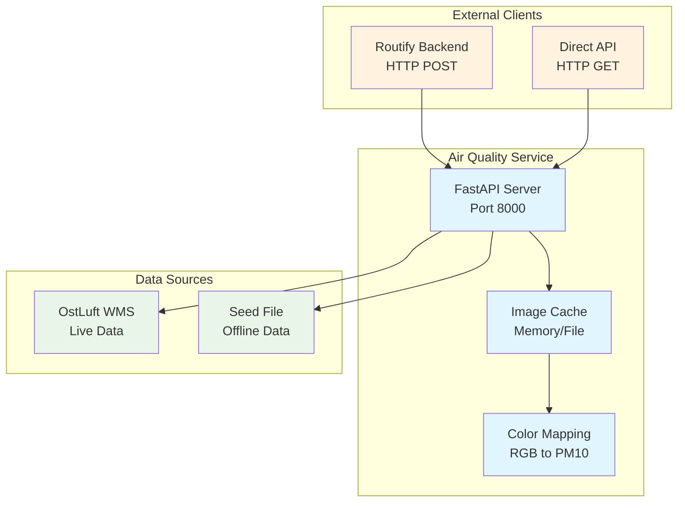

# Air Quality Service

This service provides PM10 air quality data for the Routify application by querying the OstLuft WMS service or using pre-generated seed files.

## Service Architecture



## Overview

The Air Quality Service is a FastAPI-based microservice that:
- Fetches PM10 (particulate matter) air quality data from OstLuft WMS service
- Supports both live data fetching and seed file mode for offline/development use
- Converts WMS image data to PM10 values using color mapping
- Provides REST API endpoints for coordinate-based PM10 queries

## Features

- **Live Mode**: Fetches real-time data from OstLuft WMS every 5 minutes
- **Seed Mode**: Uses pre-generated PNG files for offline/development use
- **Coordinate Querying**: Get PM10 values for specific lat/lon coordinates
- **Data Export**: Export data as GeoTIFF raster or CSV files
- **Status Monitoring**: Health check and service status endpoints

## API Endpoints

### POST /get_pm10
Get PM10 values for specific coordinates.

**Request:**
```json
[
  {"lat": 47.380434, "lon": 8.539759, "id": 1},
  {"lat": 47.390434, "lon": 8.549759, "id": 2}
]
```

**Response:**
```json
[
  {"pm_10": 42.0, "id": 1},
  {"pm_10": 38.0, "id": 2}
]
```

### GET /status
Get current service status and configuration.

**Response:**
```json
{
  "mode": "seed",
  "seed_file": "seed_1752321204.png",
  "last_update": "2024-01-15T10:30:00",
  "image_size": "4096x4096",
  "data_source": "Seed file: seed_1752321204.png",
  "uptime_seconds": 3600
}
```

### GET /export/raster
Export PM10 data as GeoTIFF raster file.

### GET /export/csv
Export PM10 data as CSV file with lat/lon/PM10 values.

### GET /help
Get comprehensive API documentation.

## Usage Modes

### Live Mode (Default)
Fetches data from OstLuft WMS service:
```bash
docker run -p 8000:8000 airqualityservice
```

### Seed Mode
Uses pre-generated seed file:
```bash
docker run -p 8000:8000 airqualityservice python OstLuftApi.py --use-seed seed_1752321204.png
```

### Generate Seed File
Create a new seed file from current WMS data:
```bash
docker run airqualityservice python OstLuftApi.py --generate-seed
```

## Configuration

### Service Configuration

The Air Quality Service can be configured in several ways:

#### 1. Docker Compose Configuration
```yaml
airqualityservice:
  build:
    context: ./airqualityservice
    dockerfile: Dockerfile
  ports:
    - "8000:8000"
  networks:
    - routify-network
  command: ["python", "OstLuftApi.py", "--use-seed", "seed_1752321204.png"]
  healthcheck:
    test: ["CMD-SHELL", "curl -f http://localhost:8000/status || exit 1"]
    interval: 30s
    timeout: 10s
    retries: 3
    start_period: 30s
```

#### 2. Environment Variables
- `USE_SEED_MODE`: Set to "true" to use seed mode
- `SEED_FILE`: Path to seed file (when in seed mode)
- `WMS_URL`: OstLuft WMS service URL (default: https://ostluft.meteotest.ch/wms)
- `UPDATE_INTERVAL`: Update interval in seconds (default: 300)

#### 3. Command Line Arguments
```bash
# Live mode (default)
python OstLuftApi.py

# Seed mode
python OstLuftApi.py --use-seed seed_1752321204.png

# Generate new seed file
python OstLuftApi.py --generate-seed

# Custom WMS URL
python OstLuftApi.py --wms-url https://custom-wms.com
```

### Coverage Area
- **Region**: Switzerland (Zurich area)
- **Bounds**: 
  - Min Lat: 47.3202187, Max Lat: 47.4346662
  - Min Lon: 8.4480061, Max Lon: 8.6254413
- **Coordinate System**: EPSG:4326 (WGS84)

### Data Source
- **Live Mode**: OstLuft WMS service (https://ostluft.meteotest.ch/wms)
- **Layer**: PM10_actual
- **Update Frequency**: Every 5 minutes
- **Image Size**: 4096x4096 pixels

## PM10 Values

- **Unit**: μg/m³ (micrograms per cubic meter)
- **Range**: 0-102 μg/m³
- **Mapping**: Color-to-value mapping from OstLuft WMS image
- **No Data**: Returns -1.0 when no data is available

## Error Handling

- **No Data Available**: Returns PM10 value of -1.0
- **Invalid Coordinates**: Coordinates outside bounds are clamped to image edges
- **File Not Found**: Returns error message when seed file is not found
- **WMS Errors**: Logs errors and continues with last known data

## Development

### Local Development
```bash
# Install dependencies
pip install -r requirements.txt

# Run in live mode
python OstLuftApi.py

# Run with seed file
python OstLuftApi.py --use-seed seed_1752321204.png

# Generate new seed file
python OstLuftApi.py --generate-seed
```

### Docker Development
```bash
# Build image
docker build -t airqualityservice .

# Run container
docker run -p 8000:8000 airqualityservice

# Run with seed file
docker run -p 8000:8000 airqualityservice python OstLuftApi.py --use-seed seed_1752321204.png
```

## Integration with Routify

This service is used by the Routify backend to provide air quality data for routing calculations. The backend queries this service via HTTP POST requests to `/get_pm10` with vertex coordinates and receives PM10 values for each coordinate.

The service is configured in the Routify backend via the `url_airquality` setting, which points to this service's `/get_pm10` endpoint.
