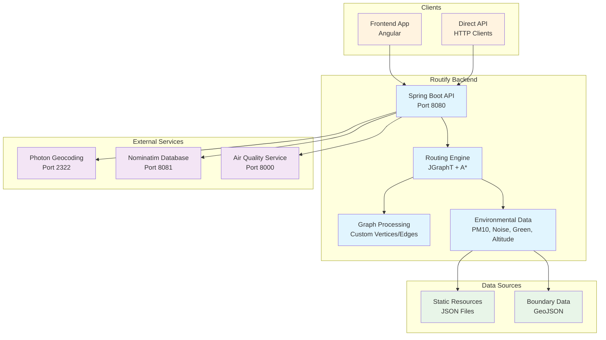
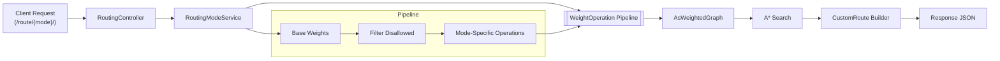

# Routify Backend

The Routify Backend is a Spring Boot-based Java application that provides the core routing engine for the Routify application. It handles route calculations, environmental data processing, and API endpoints for the frontend.

## Service Architecture



## Configuration

### Service Configuration

The Routify Backend can be configured through several methods:

#### 1. Docker Compose Configuration
```yaml
backend:
  build:
    context: ./backend
    dockerfile: Dockerfile
  ports:
    - "8080:8080"
  networks:
    - routify-network
  healthcheck:
    test: ["CMD-SHELL", "curl -f http://localhost:8080/health || exit 1"]
    interval: 30s
    timeout: 10s
    retries: 5
    start_period: 120s
```

#### 2. Development Mode Configuration
The backend supports a development mode that can be enabled via command-line arguments:

```bash
# Run with development mode enabled
mvn spring-boot:run -Dspring-boot.run.arguments="--devmode"

# Or when running the JAR directly
java -jar target/*.jar --devmode
```

**What Development Mode Does:**
Development mode is primarily used for debugging and analysis of the routing graph structure. When enabled, it:

- **Exports the graph as a GEXF file** (`graph_YYYY-MM-DD.gexf`) in the working directory
- **GEXF format** is compatible with network analysis tools like Gephi, Cytoscape, or NetworkX
- **Graph structure** includes all vertices (intersections) and edges (road segments) with their properties
- **Useful for** debugging routing issues, analyzing network topology, or research purposes

**When to Use Development Mode:**
- Debugging routing problems
- Analyzing the graph structure and connectivity
- Research and development of routing algorithms
- Understanding how the road network is represented

**When NOT to Use Development Mode:**
- Production deployments (adds unnecessary file I/O)
- Regular application usage (no benefit for end users)
- Docker containers (unless you need to extract the graph file)

#### 3. Environment Variables
- `JAVA_OPTS`: JVM options (e.g., -Xmx4g -Xms2g)
- `SERVER_PORT`: Server port (default: 8080)

#### 4. Service URLs Configuration
The backend connects to external services via configured URLs:
```java
// In Routify.java
public static final String url_geocoder = "photon:2322";
public static final String url_airquality = "http://airqualityservice:8000/get_pm10";
public static final String url_api = "http://localhost:8080";
```

### Routing Modes and Weight Pipelines

Routing behaviour is now fully configuration-driven. Each routing mode is described in
`src/main/resources/routing-modes.json` and is exposed automatically through the generic
endpoint `POST /route/{routing_mode}/`.

```json
{
  "routing_mode_green": [
    { "operation": "base" },
    { "operation": "filter-disallowed" },
    { "operation": "green-index", "params": { "impactField": "green_index", "accelerate": 2.0 } }
  ]
}
```

At request time the backend turns the configured list of `operations` into a pipeline of
weight transformations. Operations ship with sensible defaults but can be parameterised
through the optional `params` object.

Available operations

| Operation            | Purpose                                                        | Common parameters                              |
|----------------------|----------------------------------------------------------------|------------------------------------------------|
| `base`               | Clones the pre-computed weight map for the transport mode      | —                                              |
| `filter-disallowed`  | Disables edges whose highway tag is not allowed for the mode   | —                                              |
| `slope`              | Penalises edges exceeding a slope threshold                    | `thresholdField` (default `slope`)             |
| `green-index`        | Rewards greener edges                                          | `impactField`, `accelerate`                    |
| `noise`              | Penalises noisy edges                                          | `impactField`, `accelerate`                    |
| `air`                | Penalises edges with higher PM10 values                        | `impactField`, `alpha`                         |

Adding a new routing mode only requires two steps:

1. Append a new entry to `routing-modes.json` with the desired operations and parameters.
2. Call the API via `POST /route/<your_mode>/` with the usual request payload. The controller
   resolves the mode dynamically from the configuration.

If you need a brand-new operation, create a class under
`ch.routify.routing.operations` that implements `WeightOperation`, register it in
`WeightOperationFactory`, and reference it by name in the JSON. The runtime will pick it up
without touching the controllers or the routing core.

### Route Computation Workflow



## Documentation

### Doxygen Documentation

The backend code is Doxygen-compliant with comprehensive Javadoc comments. You can use [Doxygen](https://www.doxygen.nl/index.html) to generate API documentation from the Java source code.

## Getting Started
These instructions will get you a copy of the project up and running on your local machine for development and testing purposes.

### Prerequisites

What things you need to install the software and how to install them:

- OpenJDK 17 (required)
- Apache Maven 3.6.3 or later
- other dependencies are handled by Maven

Note: Ensure Maven uses Java 17. On macOS (Homebrew):

```
export JAVA_HOME="/opt/homebrew/opt/openjdk@17"
export PATH="$JAVA_HOME/bin:$PATH"
```

### Installing
1. Clone the repository:

```
git clone https://github.com/ethz-coss/routify.git
```

2. Navigate into the backend directory:

```
cd routify/backend
```

3. Run the application:

```
mvn spring-boot:run -Dspring-boot.run.arguments="--devmode"
```

The application should now be running on `localhost:8080`.

## Deployment

TODO: Add additional notes about how to deploy this on a live system.

## Built With

* [Spring Boot](https://spring.io/projects/spring-boot) - The web framework used
* [Maven](https://maven.apache.org/) - Dependency Management

## Running the Application

### Local Development

From the backend directory:

```bash
# Ensure Java 17 is active (macOS/Homebrew example)
export JAVA_HOME="/opt/homebrew/opt/openjdk@17"
export PATH="$JAVA_HOME/bin:$PATH"

# Start the application
mvn spring-boot:run

# Or with development mode
mvn spring-boot:run -Dspring-boot.run.arguments="--devmode"
```

### Production Build

```bash
# Build the application
mvn clean package -DskipTests

# Run the JAR
java -jar target/*.jar
```

### Service Endpoints

- **API**: http://localhost:8080
- **Health Check**: http://localhost:8080/health

## Data Sources

The backend uses static JSON files for environmental data:

- **Altitude Data**: `src/main/resources/static/altitude_admin_level_8.json`
- **Noise Data**: `src/main/resources/static/noise_admin_level_8.json`
- **Green Index**: `src/main/resources/static/green_index_admin_level_8.json`
- **Boundary Data**: `src/main/resources/static/boundary_admin_level_8.geojson`
- **Base Map**: `src/main/resources/static/basemap_admin_level_8.json`
- **Configuration**: `src/main/resources/static/config_features.json`
