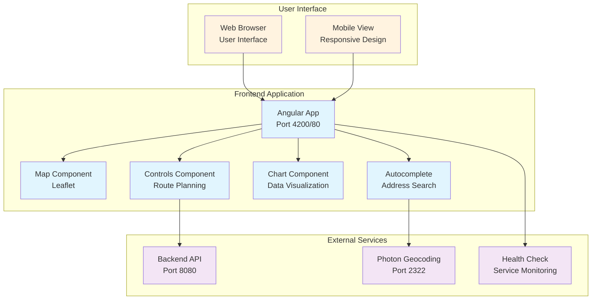

# Routify Frontend

Routify Frontend is an Angular web application that provides a rich UI for the Routify routing engine (served by the Routify Backend). It offers interactive route planning, map overlays, and analysis tools for air quality, elevation, noise, and more.

## Service Architecture



## Prerequisites

- Node.js LTS (recommended)
- npm (bundled with Node.js)
- Angular CLI installed globally

```bash
npm install -g @angular/cli
```

You can verify your environment with:

```bash
ng version
```

The project targets Angular 17.

## Installation

```bash
git clone <your-repo-url>
cd frontend
npm install
```

## Configuration

### Service Configuration

The Frontend can be configured through several methods:

#### 1. Docker Compose Configuration
```yaml
frontend:
  build:
    context: ./frontend
    dockerfile: Dockerfile
  ports:
    - "80:80"
  networks:
    - routify-network
  depends_on:
    backend:
      condition: service_healthy
  healthcheck:
    test: ["CMD-SHELL", "curl -f http://localhost:80 || exit 1"]
    interval: 30s
    timeout: 10s
    retries: 3
    start_period: 30s
```

#### 2. Application Configuration
Application settings live in `src/app/config.ts`. The frontend automatically detects the environment:

**Local Development (localhost):**
- Uses direct URLs: `http://localhost:8080` for backend, `http://localhost:2322/` for Photon
- Automatically detected when running on `localhost` or `127.0.0.1`

**Production:**
- Uses relative paths: `/api/*` for backend, `/photon/` for Photon
- Routes through Caddy reverse proxy on port 443 (HTTPS)
- Automatically detected when running on production domain

```typescript
export const config: AppConfig = {
  // API Endpoints (used for localhost detection fallback)
  backendUrl: 'http://localhost:8080',  // Used only in local development
  photonUrl: 'http://localhost:2322/',  // Used only in local development
  
  // Map Services
  thunderforestApiKey: '7c80840849bd4b99a9dcd1372204947e',
  ostluftWmsUrl: 'https://ostluft.meteotest.ch/wms?',
  
  // External Services
  openstreetmapUrl: 'https://www.openstreetmap.org',
  arcgisUrl: 'https://server.arcgisonline.com/ArcGIS/rest/services/World_Imagery/MapServer/tile',
  opentopomapUrl: 'https://tile.opentopomap.org',
  cartoUrl: 'https://{s}.basemaps.cartocdn.com/light_all',
  
  // Contact Information
  contactEmail: 'secretary-coss@coss.ethz.ch',
  githubUrl: 'https://github.com/ethz-coss/routify',
  researchPaperUrl: 'https://dl.acm.org/doi/10.1145/3640457.3691702',
  cossWebsiteUrl: 'https://coss.ethz.ch'
};
```

**Environment Detection:**
The frontend automatically detects the environment by checking `window.location.hostname`:
- **Localhost**: Uses `config.backendUrl` and `config.photonUrl` (direct access)
- **Production**: Uses relative paths (routes through Caddy)

#### 3. Nginx Configuration
The frontend uses Nginx for serving static files. In production, routing is handled by Caddy:

```nginx
server {
    listen 80;
    server_name localhost;
    root /usr/share/nginx/html;
    index index.html;

    # Handle Angular routing
    location / {
        try_files $uri $uri/ /index.html;
    }
}
```

**Note:** In production, Caddy handles all routing (including `/photon/*` and `/api/*`). Nginx only serves the static Angular application.

#### 4. Environment Variables
**Note:** The frontend uses automatic environment detection based on `window.location.hostname`. Environment variables are not currently used for URL configuration. The application automatically:
- Uses direct URLs (`http://localhost:8080`, `http://localhost:2322/`) when running on localhost
- Uses relative paths (`/api/*`, `/photon/`) when running on production domains

Build-time environment variables (set during Docker build):
- `FRONTEND_VERSION`: Version from package.json
- `GIT_COMMIT_HASH`: Git commit hash
- `BUILD_DATE`: Build timestamp

## Running locally (development)

1. Start the Routify Backend locally (default: `http://localhost:8080`).
2. Start the frontend dev server:

```bash
npm start
# or
ng serve
```

3. Open `http://localhost:4200` in your browser.

## Production build

Build the optimized production bundle:

```bash
npm run build
# or
ng build
```

The output will be written to `dist/`.

### Version metadata (prebuild)

This project includes a prebuild step that generates version metadata used by the UI:

```json
scripts: {
  "prebuild": "node scripts/generate-version.js"
}
```

What it does:
- Runs before `npm run build`.
- Creates `src/assets/version.json` with:
  - `version`: from `package.json`.
  - `gitHash`: short commit hash (`git rev-parse --short HEAD`).
  - `buildDate`: ISO timestamp of the build.

Source: `scripts/generate-version.js`. The app can display this info (e.g., in an About dialog) by fetching `/assets/version.json` at runtime.

## Used technologies and main libraries

- Angular 17, Angular CLI
- RxJS, TypeScript
- Angular Material (`@angular/material`, `@angular/cdk`)
- Leaflet for web mapping, plus plugins:
  - `leaflet-groupedlayercontrol`
  - `leaflet-compass`
  - `leaflet-rotate`
  - `leaflet-maskcanvas`
- Charts: `ng-apexcharts` (pinned to `1.7.6` for Angular 17 compatibility) and `apexcharts`
- UI components: `@ng-select/ng-select`
- Geospatial utilities: `proj4`, `proj4leaflet`
- UX helpers: `sweetalert2`

## Common scripts

```json
{
  "start": "ng serve",
  "build": "ng build",
  "test": "ng test"
}
```

## Troubleshooting

- On install conflicts, try: `npm install --legacy-peer-deps`.
- If you change map-related assets or configs, restart the dev server to ensure Leaflet layers reload correctly.
