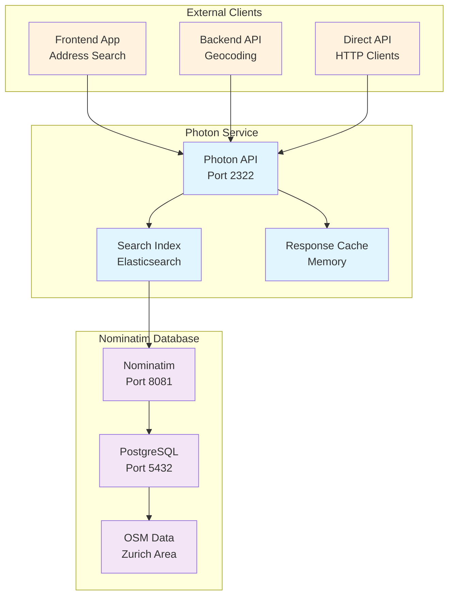

# Photon Geocoding Service

This directory contains a Photon geocoding service that connects to a Nominatim database with Zurich data. Photon provides fast geocoding and reverse geocoding capabilities optimized for search performance.

## Service Architecture



## Features

- Photon geocoding service connected to Nominatim
- Nominatim database with Zurich OSM data
- Persistent data storage
- Health checks for both services

## Quick Start

```bash
# Start both Nominatim and Photon services
docker-compose up --build nominatim photon

# Test the services
curl "http://localhost:8081/search?q=zurich&format=json&limit=5"  # Nominatim
curl "http://localhost:2322/api?q=zurich"  # Photon
```

## Services

### Nominatim (Port 8081)
- Full geocoding and reverse geocoding
- Zurich OSM data preloaded
- Web interface available

### Photon (Port 2322)
- Fast geocoding API
- Connected to Nominatim database
- Optimized for search performance

## API Usage

**Nominatim API:**
```
GET /search?q=search_term&format=json&limit=5
```

**Photon API:**
```
GET /api?q=search_term
```

## Configuration

### Service Configuration

The Photon service can be configured through several methods:

#### 1. Docker Compose Configuration
```yaml
photon:
  build:
    context: ./photon
    dockerfile: Dockerfile
  ports:
    - "2322:2322"
  networks:
    - routify-network
  depends_on:
    nominatim:
      condition: service_healthy
  healthcheck:
    test: ["CMD-SHELL", "curl -f http://localhost:2322/api?q=test || exit 1"]
    interval: 30s
    timeout: 10s
    retries: 3
    start_period: 30s
```

#### 2. Nominatim Configuration
```yaml
nominatim:
  image: mediagis/nominatim:4.2
  environment:
    - PBF_URL=https://download.geofabrik.de/europe/switzerland-latest.osm.pbf
    - REPLICATION_URL=https://download.geofabrik.de/europe/switzerland-updates
    - IMPORT_WIKIPEDIA=false
    - NOMINATIM_PASSWORD=password
  ports:
    - "8081:8080"
  networks:
    - routify-network
  volumes:
    - nominatim_data:/var/lib/postgresql/14/main
  healthcheck:
    test: ["CMD-SHELL", "curl -f http://localhost:8080/status || exit 1"]
    interval: 60s
    timeout: 10s
    retries: 10
    start_period: 300s
```

#### 3. Environment Variables
- **Nominatim**: Downloads and imports Zurich OSM data on first run
- **Photon**: Connects to Nominatim database for data
- **Data persistence**: Both services use Docker volumes
- **Health checks**: Services wait for dependencies to be ready

#### 4. Data Configuration
- **Coverage Area**: Switzerland (Zurich area)
- **Data Source**: OpenStreetMap via Geofabrik
- **Update Frequency**: Manual updates via replication URL
- **Database**: PostgreSQL with PostGIS extensions

## Notes

- First startup will take 5-10 minutes to import Zurich data
- Data is persisted between container restarts
- Both services are connected via Docker network
